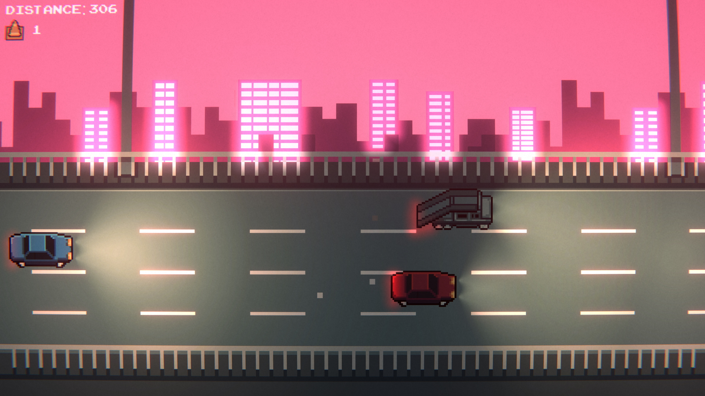

# Summary

This is my first fully finished game. The inspiration of this game was Jetpack Joyride, except with cars. It was made using the Unity game engine. 
Unity primarily uses C# as the programming language.

# Objectives

The goal of the game is to beat all four stages. Currently there is no endless mode, however I
may add more features in the future. You can collect coins to unlock different vehicles. Vehicles
are purely cosmetic and do not give any other advantages. Along with the coins, you must avoid
other vehicles, except for a ramp truck

# Gameplay Pictures

Pictures aren't working currently, I just have them as placeholders...

# Download
It is up for download on itch.io.

# Reflection

This game has been 90% done since 2021, however I started college and stopped working on it
until 2022. I finished the game however haven't published it until now. Like before, it fell to the
wayside since I was focusing on college and other projects that were piquing my interest.